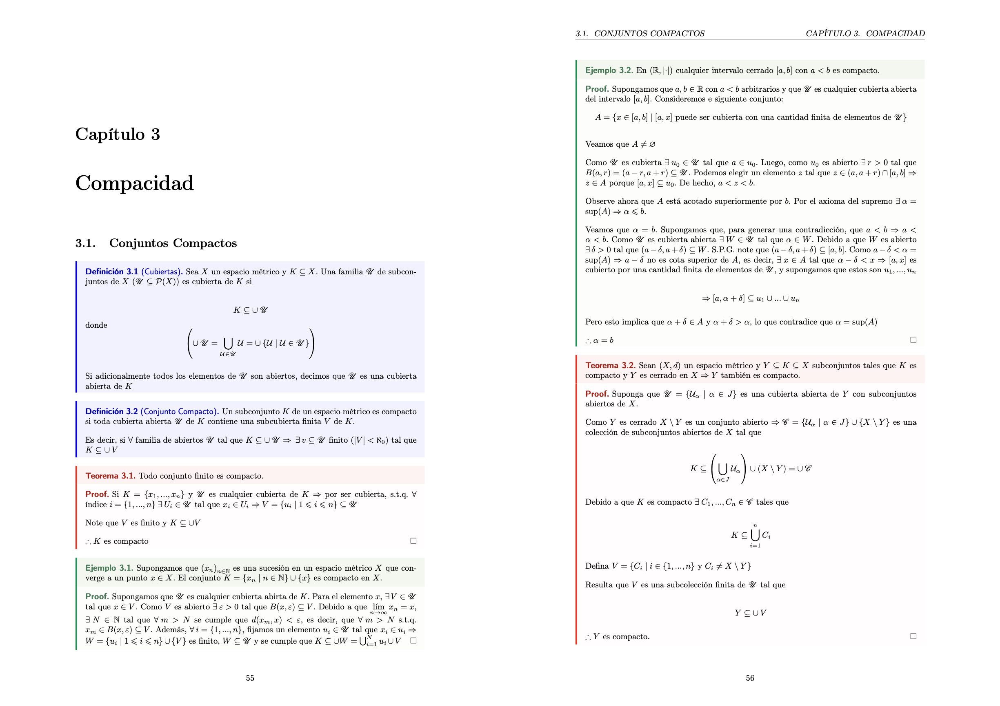

## Descripción

Notas de clase de Análisis Matemático I del Dr. Fidel Casarrubias Segura de la Facultad de Ciencias de la UNAM. Estas notas están en español y cubren todo el temario oficial de la materia.

## Contenido

Incluye notas de clase, y algunas tareas del curso. Estas notas tomaron como base el preámbulo de las notas de [Gilles Castel](https://github.com/gillescastel/lecture-notes). La bibliografía oficial de este curso es el libro de Análisis Matemático I de Mónica Clapp.

## ¿Cómo se ven las notas?

